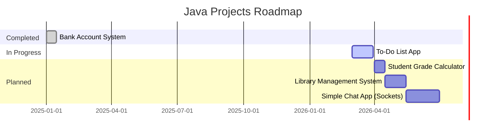

<div align="center">


# Java Small Projects

### A collection of mini Java projects built to master Core Java & OOP concepts


</div>

---

## 📌 Table of Contents

- [About](#-about)
- [Tech Stack](#-tech-stack)
- [Projects](#-projects)
- [What I'm Practicing](#-what-im-practicing)
- [Repo Structure](#-repo-structure)
- [Getting Started](#-getting-started)
- [Roadmap](#-roadmap)
- [Author](#-author)

---

## 📖 About

This repository is my **Java learning playground**. Each folder is a standalone mini-project focused on a specific concept or real-world problem. I build these to strengthen my understanding of:

- Core Java syntax and constructs
- Object-Oriented Programming (OOP)
- Console-based I/O and input handling
- Problem decomposition and clean code habits

> *"The best way to learn programming is to write programs."* — Dennis Ritchie

---

## 🛠️ Tech Stack

| Tool | Purpose |
|---|---|
|  | Primary programming language |
|  | Code editor |
|  | Alternative IDE |
|  | Version control |
|  | Code hosting |
| `javac` / `java` | Compile & run (no build tool yet) |

---

## 📂 Projects

> More projects are added regularly. Each has its own folder and `readme.md`.

### 🏦 1. Bank Account System

> **Status:** `✅ Complete`

A console-based banking app simulating real deposit, withdrawal, and balance check operations.

| Feature | Description |
|---|---|
| 💰 Deposit | Add funds and see updated balance |
| 🏧 Withdrawal | Withdraw funds from account |
| 📊 Balance Check | View current account balance |

**Concepts used:** Classes & Objects, Instance Methods, Scanner I/O, Conditionals

📁 [`bank-system/`](./bank-system/) &nbsp;|&nbsp; 📝 [`View README`](./bank-system/readme.md)

---

### ✅ 2. To-Do List App

> **Status:** `🕒 Upcoming`

A console to-do manager where you can add, view, complete, and remove tasks.

| Feature | Description |
|---|---|
| ➕ Add Task | Add a new task to your list |
| 📋 View All | Display all current tasks |
| ✔️ Mark Done | Mark a task as completed |
| 🗑️ Remove | Delete a task from the list |

**Concepts planned:** `ArrayList`, Loops, User input handling, Basic CRUD logic

---

## 🧠 What I'm Practicing

```
✔ Writing clean and readable Java code
✔ Breaking problems into smaller focused functions
✔ Object-Oriented Programming (Classes, Objects, Encapsulation)
✔ Handling user input with Scanner and validating it
✔ Using Java Collections (ArrayList, HashMap)
✔ Building real-world style console applications
```

---

## 🗂️ Repo Structure

```
📦 java-Small-Projects-/
├── 📁 bank-system/
│   ├── 📄 BankAccount.java
│   ├── 📄 BankAccount.class
│   └── 📄 readme.md
├── 📁 todo-list/              ← coming soon
└── 📄 README.md
```

---

## 🚀 Getting Started

### Prerequisites

- ✅ Java JDK **8 or above**
- ✅ `javac` and `java` available in your terminal PATH

### Clone & Run Any Project

```bash
# Clone the repo
git clone https://github.com/Uttkarshchambiyal/java-Small-Projects-.git

# Enter any project folder
cd java-Small-Projects-/bank-system

# Compile
javac BankAccount.java

# Run
java BankAccount
```

---

## 🗺️ Roadmap



---

## 👨‍💻 Author

<div align="center">


**Uttkarsh Chambiyal**

*B.Tech CSE Student | Java Learner | Full-Stack Dev in Progress*

[](https://github.com/Uttkarshchambiyal)
[](https://linkedin.com/in/uttkarshchambiyal)

</div>

---

<div align="center">

⭐ **Star this repo if it helped or inspired you!** ⭐


*“Every expert was once a beginner.” 🚀*

</div>
