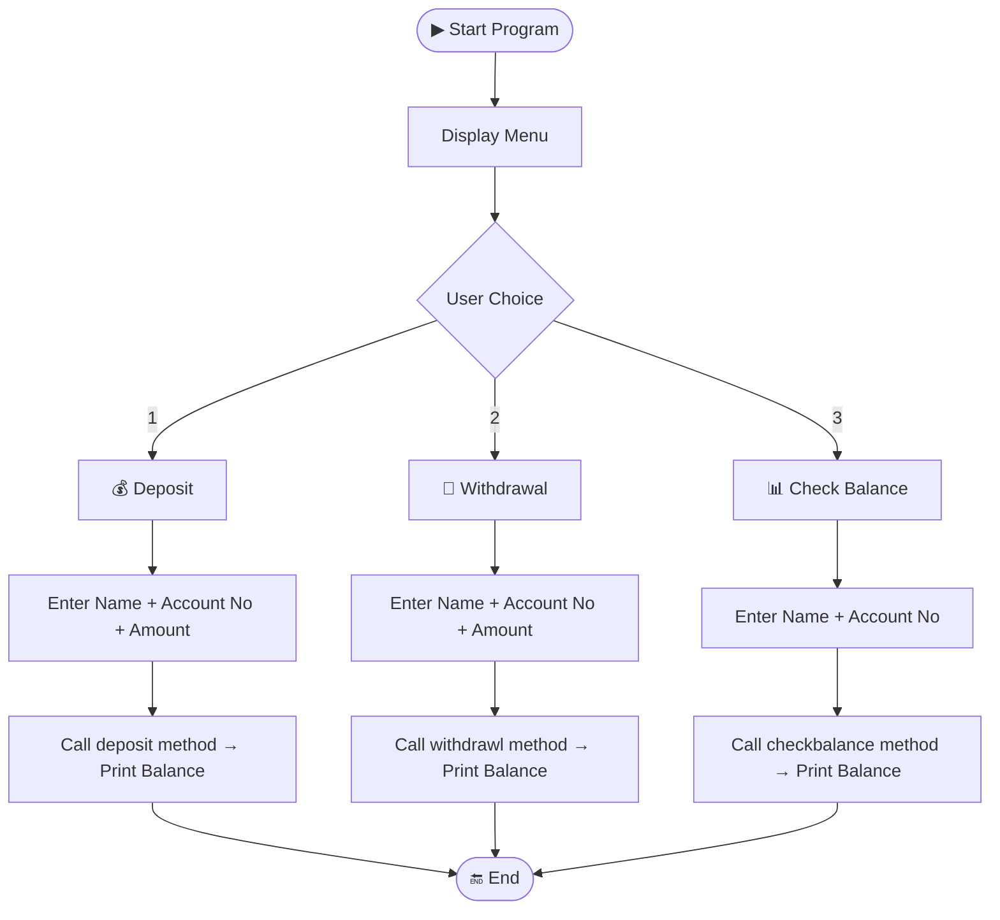

<div align="center">

# 🏦 Bank System

### A Console-Based Banking Application built with Java


> A beginner-friendly Java mini project that simulates core banking operations — deposit, withdraw, and balance check — all from the terminal.

</div>

---

## 📌 Table of Contents

- [Features](#-features)
- [Demo](#-demo)
- [How It Works](#-how-it-works)
- [Project Structure](#-project-structure)
- [Getting Started](#-getting-started)
- [Concepts Used](#-concepts-used)
- [Future Improvements](#-future-improvements)
- [Author](#-author)

---

## ✨ Features

| Feature | Description |
|---|---|
| 💰 **Deposit** | Add money to your account and view updated balance |
| 🏧 **Withdrawal** | Withdraw money and see remaining balance |
| 📊 **Balance Check** | Instantly view your current account balance |
| 👤 **Account Info** | Set account holder name and account number |
| 🖥️ **Console Menu** | Easy-to-use numbered menu interface |

---

## 🎬 Demo

```
╔══════════════════════════════════════╗
║        🏦  BANK SYSTEM MENU          ║
╠══════════════════════════════════════╣
║  1. 💰  Deposit                      ║
║  2. 🏧  Withdrawal                   ║
║  3. 📊  Check Balance                ║
╚══════════════════════════════════════╝

Enter your choice: 1
Enter Account Holder Name: John Doe
Enter Account Number: 123456
Enter amount to deposit: 5000

✅ ₹5000 deposited successfully!
📊 Current Balance: ₹25000
```

---

## ⚙️ How It Works



---

## 📁 Project Structure

```
📦 bank-system/
├── 📄 BankAccount.java     ← Main class with menu & input handling
├── 📄 BankAccount.class    ← Compiled bytecode
└── 📄 readme.md            ← Project documentation
```

> **`BankAccount.java`** contains two classes:
> - **`Bank`** — Holds account data (`balance`, `accountHolderName`, `accountNumber`) and exposes `deposit()`, `withdrawl()`, and `checkbalance()` methods.
> - **`BankAccount`** — Entry point with `main()`, handles Scanner input and the interactive menu.

---

## 🚀 Getting Started

### Prerequisites

- ✅ Java JDK **8 or above** installed
- ✅ `java` and `javac` added to your system **PATH**

### Installation & Run

```bash
# 1. Clone the repository
git clone https://github.com/Uttkarshchambiyal/java-Small-Projects-.git

# 2. Navigate to the bank-system folder
cd java-Small-Projects-/bank-system

# 3. Compile the Java file
javac BankAccount.java

# 4. Run the program
java BankAccount
```

---

## 🧠 Concepts Used

```
✔ Object-Oriented Programming (OOP)
✔ Classes and Objects
✔ Instance Variables and Methods
✔ Console I/O with Scanner
✔ Conditional Statements (if-else / switch)
✔ Basic Arithmetic Operations
```

---

## 🔮 Future Improvements

- [ ] 🔐 Add PIN/password authentication
- [ ] 🔁 Loop menu for multiple operations per session
- [ ] 👥 Support multiple accounts using `ArrayList`
- [ ] ⚠️ Input validation & insufficient funds check
- [ ] 📁 File-based data persistence (save accounts between runs)
- [ ] 🖥️ Upgrade to a GUI using Java Swing

---

## 👨‍💻 Author

<div align="center">

**Uttkarsh Chambiyal**

[](https://github.com/Uttkarshchambiyal)

*"Building one mini project at a time 🚀"*

</div>

---

<div align="center">

⭐ **If you found this helpful, give it a star!** ⭐

</div>
